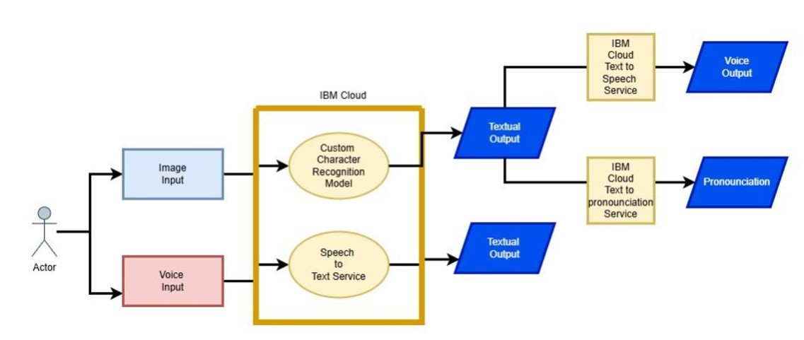
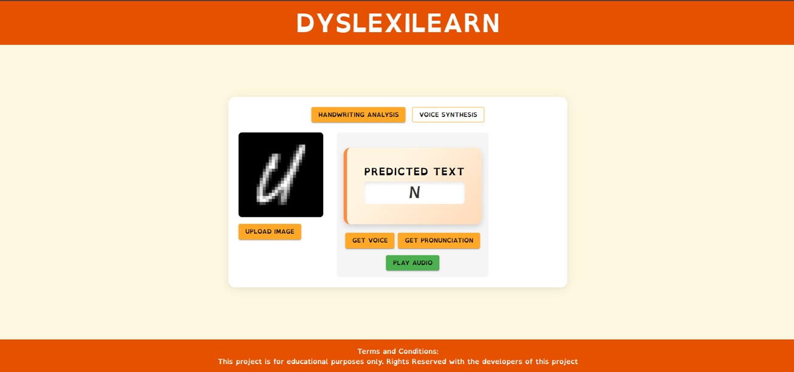
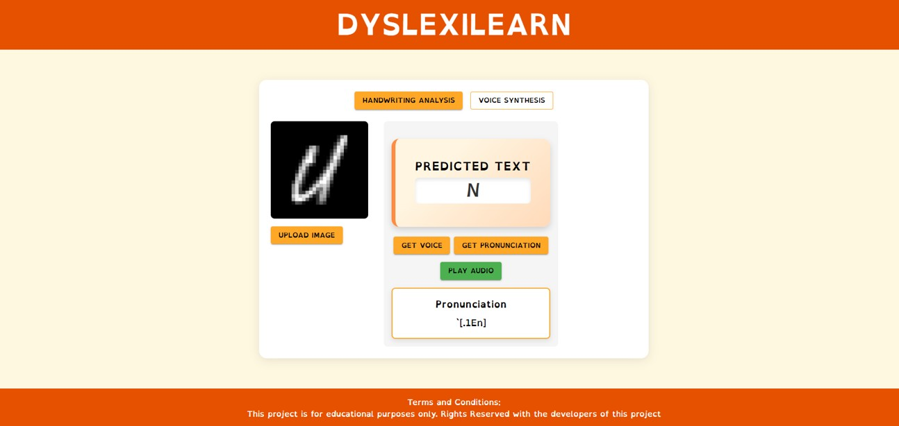
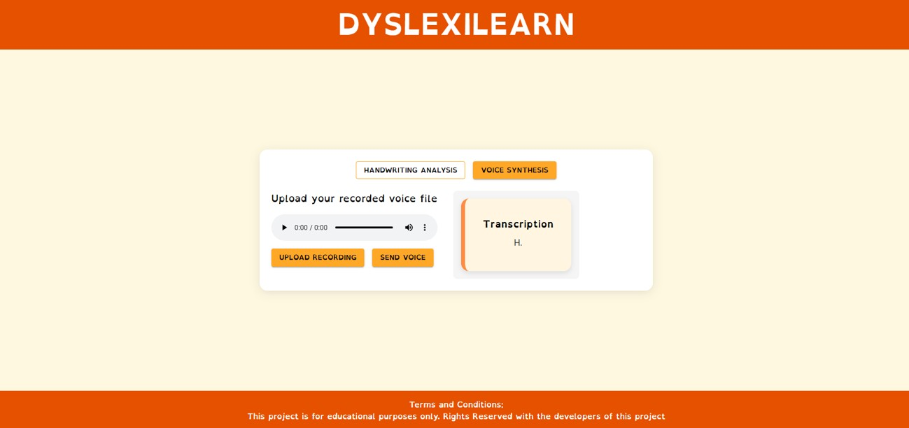

# DyslexiLearn

This repository contains the source code and resources for our dyslexia assistance software, which helps individuals by providing OCR-based text recognition, pronunciation assistance, and speech-to-text transcription.
This project is for IBM SkillsBuild Hackathon conducted from 13 Jan 2025 to 31 Jan 2025

## Contributors
- Harsh Doshi  hdoshi319@gmail.com
- Saniya Gupte  saniyamilindgupte@gmail.com
- Mentor : Sonam Aslekar

## Folder Structure

- **FE/**: Contains the frontend application.
- **Server/**: Contains the backend API.
- **Notebooks/**: Jupyter notebooks for analysis and experimentation.
- **Tests/**: Contains test files.
- **Dataset/**: Processed dataset in CSV format.

---

## Setup Instructions

### Frontend (FE)
1. Navigate to the frontend folder:
   ```bash
   cd FE
   ```
2. Install dependencies:
   ```bash
   npm install
   ```
3. Start the development server:
   ```bash
   npm run dev
   ```

---

### Backend (Server)
1. Navigate to the backend folder:
   ```bash
   cd Server
   ```
2. Create a virtual environment:
   ```bash
   python -m venv venv
   ```
3. Activate the virtual environment:
   - On Windows:
     ```bash
     venv\Scripts\activate
     ```
   - On macOS/Linux:
     ```bash
     source venv/bin/activate
     ```
4. Install dependencies:
   ```bash
   pip install -r requirements.txt
   ```
5. Run the server:
   ```bash
   python app.py
   ```

---

### Notebooks
1. Navigate to the notebooks folder:
   ```bash
   cd Notebooks
   ```
2. Create a virtual environment:
   ```bash
   python -m venv venv
   ```
3. Activate the virtual environment:
   - On Windows:
     ```bash
     venv\Scripts\activate
     ```
   - On macOS/Linux:
     ```bash
     source venv/bin/activate
     ```
4. Install dependencies:
   ```bash
   pip install -r requirements.txt
   ```
5. Open Jupyter Notebook:
   ```bash
   jupyter notebook
   ```

---

## Tests
- The `Tests/` folder contains test files to validate different components of the software.

---

## Dataset
- The `Dataset/` folder contains the processed dataset in CSV format, which is used for training and evaluation.

---

## Contact
For any queries or support, please reach out to the project maintainers.

---

**Happy Coding!**

---

## Screenshots







